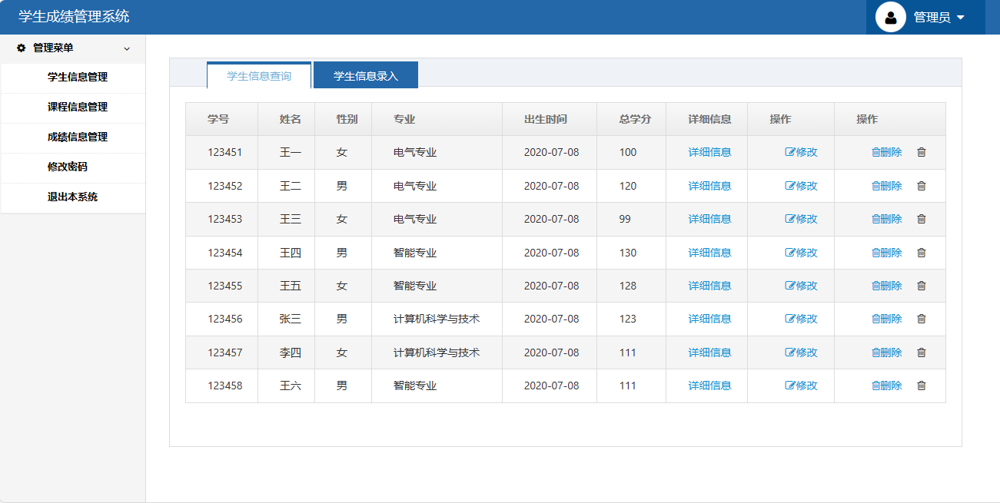
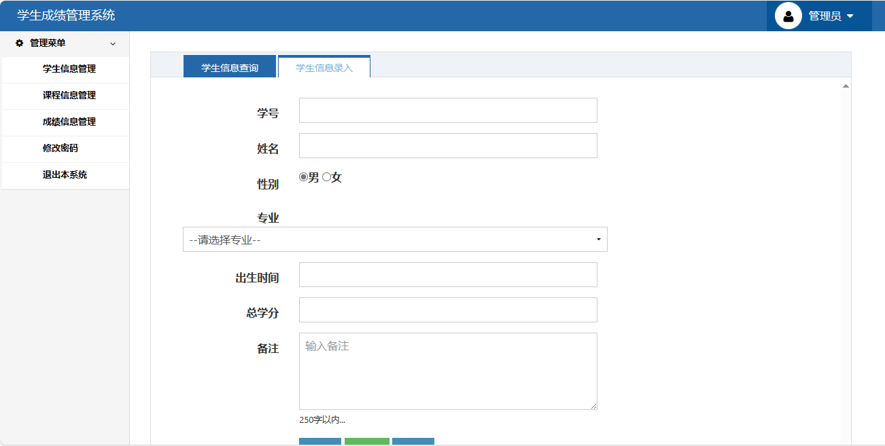
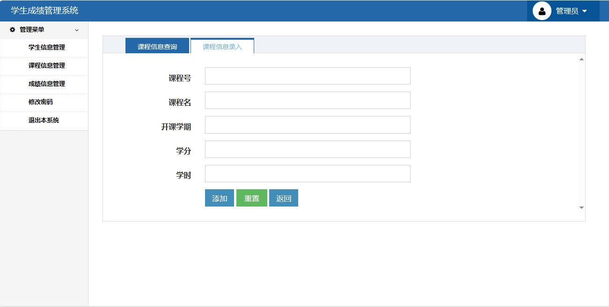
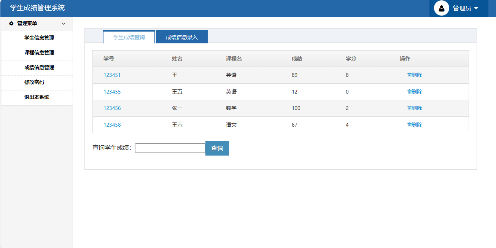
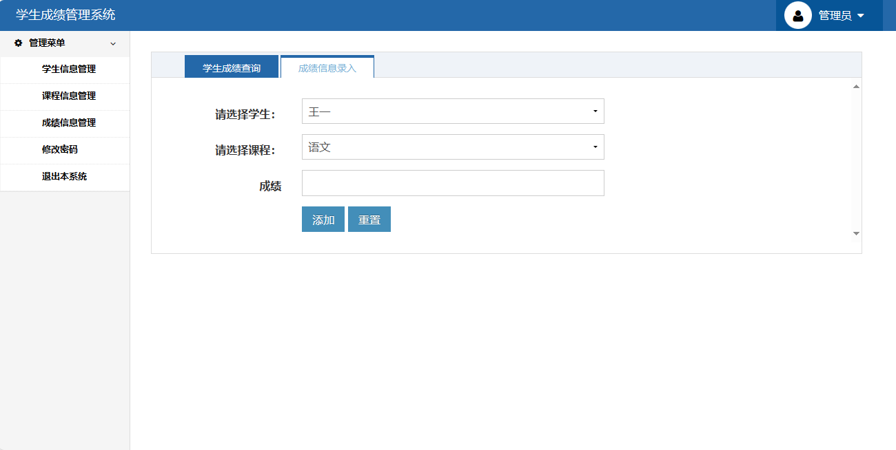

<h1 align="center">17.基于ssh的学生成绩管理系统</h1>

 获取sql文件 QQ: 386869957 QQ群: 377586148 

 [个人站点: 从戎源码网](https://armycodes.com/)

## 简介

> 本代码来源于网络,仅供学习参考使用!
>
> 提供1.远程部署/2.修改代码/3.设计文档指导/4.框架代码讲解等服务
> 
> 管理员登录地址：http://localhost:8080/login/index.jsp
>
> 管理员: admin   密码: 123456
>

## 项目介绍

基于ssh的学生信息管理系统：前端jsp、jquery，后端 struts、spring、hibernate，为了减少教务管理人员工作量、使学生成绩管理工作更加精确、使学生成绩检索更加方便及时，我们开发了此系统；主要功能如下：

### 管理员：

- 基本功能：登录、安全退出、修改密码
- 学生信息管理：学生信息列表、查看详情、学生信息修改、学生信息删除、学生信息录入
- 课程信息管理：课程信息列表、课程信息修改、课程信息删除、课程信息录入
- 成绩信息管理：关键词搜索、学生成绩列表、学生成绩删除、成绩信息录入（录入时需要先录入学生和课程信息）

## 环境

- <b>IntelliJ IDEA 2009.3</b>

- <b>Mysql 5.7.26</b>

- <b>Tomcat 7.0.73</b>

- <b>JDK 1.8</b>

## 运行截图

